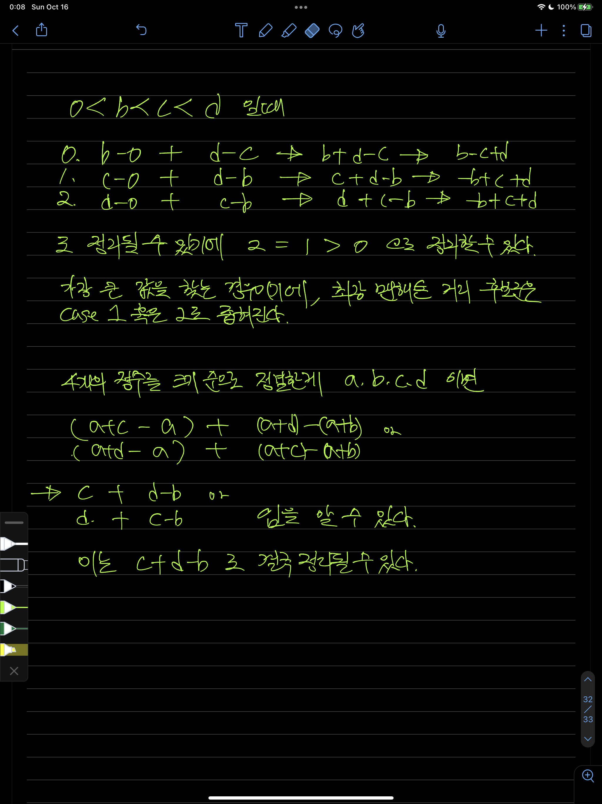

# Solution

## as-is

- `brute force` 방식으로 접근했었다.
  - 입력받은 4개의 좌표점을 기준으로 `permutation` 을 통해 모든 경우의 수를 구한다.
    - 나같은 경우 python 의 built-in module 인 `itertool` 의 `permuations` 를 사용하였었다.
  - 이 경우 time complexity 는 `O(1)` 인데, 문제의 조건을 기준으로 한다면 input 의 size 는 4로 한정되어 있고, 4개 중 4개를 뽑아서 만들 수 있는 permutation 은 `4P4 == 4! / (4-4)! == 4!`, 총 `24` 번의 연산이 고정됨을 보장할 수 있기 때문이다.

## to-be

- [해설](https://edu.goorm.io/learn/lecture/33428/%EC%95%8C%EA%B3%A0%EB%A6%AC%EC%A6%98-%EB%A8%BC%EB%8D%B0%EC%9D%B4-%EC%B1%8C%EB%A6%B0%EC%A7%80-%ED%95%B4%EC%84%A4/lesson/1667885/1%EC%A3%BC%EC%B0%A8-%EB%AC%B8%EC%A0%9C%ED%95%B4%EC%84%A4-3%EB%B2%88)이 상당히 인상깊었다. 수학적인 아이디어로 접근한다는 방식이었다.

### processes

- 좌표 지점을 만드는 데 사용되는 4개의 정수가 모두 다른값이라는 전제에 기반한다.
- 그렇다면, 해당 좌표들은 저 4개 중 어떤 수를 기준으로 하여 각각의 일정한 거리만큼 떨어져있다고 볼 수 있다.
- 편의 상 해당 4개의 정수를 increment 하게 정렬한다면, `a < a + b < a + c < a + d` 라는 식을 얻을 수 있다.
  - 그리고 a 에 0을 대입한다면, `0 < b < c < d` 라는 식 또한 얻을 수 있다.
  - 이렇게 만들어진 조합에서 구할 수 있는 멘하튼 거리는 `|b - 0| + |d - c|`, `|c - 0| + |d - b|`, `|d - 0| + |c - b|` 로 3가지 경우가 나온다.
    - 절댓값(absolute) 연산이기에 `|0 - b|` 와 `|b - 0|` 이 같은 경우로 취급되기에 저렇게 줄어들 수 있다.
- 그리고, 위에서 만들어 낸 3가지 경우 또한 부등식으로 나타낼 수 있다.
  
- 해당 과정을 좀 더 자세하게 풀어보면 이렇게 `c + d - b` 가 결국 최대 멘하튼 좌표임을 알 수 있다.
- 그리고 `a < a + b < a + c < a + d` 를 통해 입력값이 정렬되어있는 경우를 기준으로 정리하였으며, 이 상황에서 위의 값을 얻기 위해선 정렬된 배열, 이하 `coordiantes` 의 `coordinates[3] - coordinates[0]`(`d` 와 같음) 과 `coordinates[2] - coordiantes[1]`(`c - b` 와 같음) 의 합으로 정리해낼 수 있다.

### code

```python
def solution(coordinates: list[int]) -> int:
  # sort coordiantes
  coordinates.sort()
  # return the maximum case
  # it is same with...
  # (coordinates[3] - coordinates[0]) + (coordinates[2] - coordinates[1]
  return coordinates[3] + coordinates[2] - coordinates[1] - coordinates[0]
```
