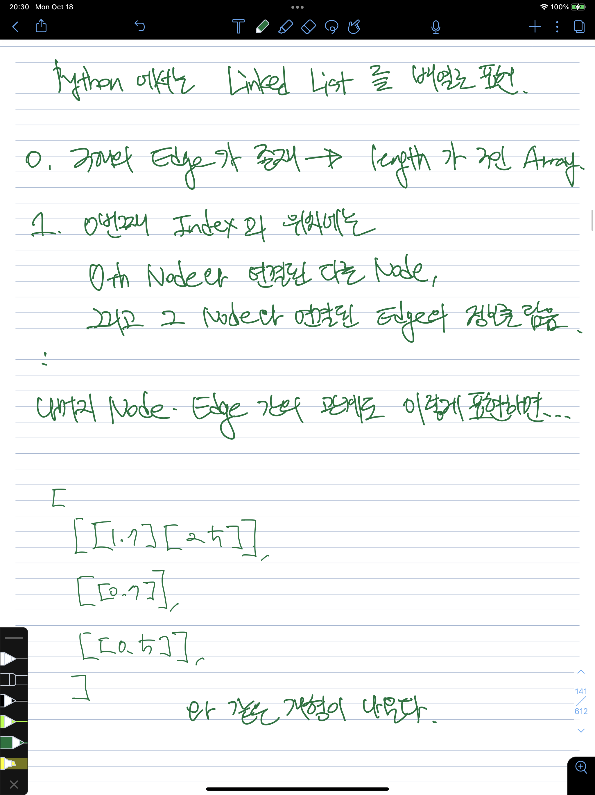

# Graph - DFS

# Prerequisite

## Stack

- 더 보기
    - First in Last out, 먼저 쌓인 게 나중에 나가는 형식이다.
        - Javascript, Python 같은 경우는 `array` type 의 자료형과 같이 딸려오는 `push()`, `pop()` method 를 통해 array object 를 stack 자료구조처럼 사용할 수 있다.
        - 코드로 나타내면 이러하다.

        ```tsx
        const arr: number[] = [1, 2, 3];
        arr.push(4) // arr is [1, 2, 3, 4]
        arr.pop() // arr is [1, 2, 3] again, and this method return 3 as a return value
        ```

        - `pop()` method 를 사용한 경우, 가장 마지막에 들어온 number type 의 value (element) 가 먼저 반환된다.

## Queue

- 더 보기
    - First in First out, 먼저 쌓인게 먼저 나가는 형식이다.
        - 마찬가지로 array type 의 자료형에서 `push()` method, 그리고 `shift()` method 를 사용하면 array object 를 queue 자료구조처럼 사용할 수 있다.
        - 코드로 나타내면 이러하다.

        ```tsx
        const arr: number[] = [1, 2, 3];
        arr.push(4) // arr is [1, 2, 3, 4]
        arr.shift() // arr is [2, 3, 4] as a result of shift() method, 
        						// and this method return 1 as a return value
        ```

        - `shift()` method 를 사용한 경우, 가장 먼저 들어온 number type 의 value (element) 가 먼저 반환된다.

## Recursion

- 더 보기
    - 정의 자체는 자기 자신을 호출하는 함수이다.
        - 그리고 일반적인 경우, 재귀함수를 설계할 때 자기 자신을 호출하는 걸 언제까지 할지를 증감식 및 조건식을 통해서 제어한다.
    - 재귀는 Call `Stack`, 즉 Stack 자료구조를 이용한다.

        ```tsx
        let counter = 0;
        
        function callItself() {
        	if (counter === 5) {
        		console.log('finished');
        		return;
        	}
        	console.log(`function call itself ${counter} times`);
        	// update counter variable 
        	counter ++;
        	// return itself as a result
        	return callItself();
        }
        
        callItself();
        ```

        ```
        VM839:8 function call itself 0 times
        VM839:8 function call itself 1 times
        VM839:8 function call itself 2 times
        VM839:8 function call itself 3 times
        VM839:8 function call itself 4 times
        VM839:5 finished
        ```

        - 해당 함수를 호출하면, 위와 같은 순서대로 실행이 된다.
        - 그러나, 이 함수가 실행되기 전에 먼저 call stack 에 해당 함수들이 담긴다.

        ```tsx
        [callAt0, callAt1, callAt2, callAt3, callAt4,]  
        ```

        - 0번째로 호출된 함수는 가장 먼저 담기고, 가장 마지막(여기서는 `counter` 기준으로 4번째)으로 호출된 함수가 가장 마지막에 담긴다.
        - 그리고, 가장 마지막에 담긴 함수부터 먼저 실행이 된다.
        - 이 내부적인 작동방식이 `Stack` 자료구조와 동일하다는 것이 일단은 핵심이다.
        - 그렇기에, Stack 자료구조를 사용해서 해결해야 하는 문제들은 재귀로 해결할 수 있다고도 볼 수 있다.
    - N Factorial(N!) 을 재귀적 방식과 반복문을 이용한 방식을 보면 조금 더 이해가 빠르다

        ```tsx
        // factorial with loop
        function factorialWithLoop(n: number) {
        	let result = 1;
        	for (let i = 1; i <= n; i++) {
        		result = result * i;
        	}
        	return result;
        }
        ```

        ```tsx
        // factorial with recursion
        function factorialWithRecursion(n: number) {
        	if (n <= 1) {
        		return 1;
        	}
        	return n * factorialWithRecursion(n-1);
        }
        ```

        - 재귀함수의 경우, 스스로를 호출하는 함수들을 `stack` 영역에 적재해야 하기에 stack memory 를 점유한다는 단점이 있지만, 코드를 사람에게 친숙한 점화식 형태로 편하게 작성할 수 있다는 장점이 존재하기도 한다.
        - n ≤ 1
            - $factorial(n) = 1$
        - n > 1
            - $factorial(n) = n * factorial(n-1)$
        - 이렇게 도출할 수 있는 factorial 의 점화식 형태와 `factorialWithRecursion` 을 비교하면 상당히 닮아있다는 사실을 알 수 있다.

# Description

- 탐색(Search)이란, 많은 양의 데이터 중에서 원하는 데이터를 찾는 과정을 의미한다.
    - 프로그래밍에서는 Graph 형 자료구조나 Tree 형 자료구조에서 탐색을 하는 문제를 자주 다룬다.
- 해당 탐색 알고리즘 중에선 `-first-search`(우선탐색) 알고리즘이 대표적이다. `DFS`, `BFS` 가 그것이다.
    - 또한, 이 알고리즘을 위해서는 위에 적은 것처럼 사전지식(Prerequisite)으로 Stack, Queue 와 Recursion 에 대한 이해가 필요하다.

## How to describe a graph?

- `Graph` 형식의 자료구조를 탐색하는 탐색 알고리즘이기에, Graph 형식을 어떻게 표현하는지도 알아야 할 필요가 있다.
- 해당 책에서는 Graph 를 표현하는 `Adjacency List` 와 `Adjacency Matrix` 방식을 안내한다.

### Adjacency List


- 하나의 node 의 index 에 연결된 나머지 다른 모든 node 들의 정보 + 해당 node 에 도달할 수 있는 edge 정보를 넣는 방식이다.

### Adjacency Matrix



- 2차원 배열의 형태로 node - edge - edge 의 관계를 저장하는 방식이다.

### Comparison


- 두 방식 중 어떤 방식이 절대적으로 좋진 않다. 책에서는 상황에 따라 좀 더 적절한 방법이 있을 뿐이라고 안내하고 있다.